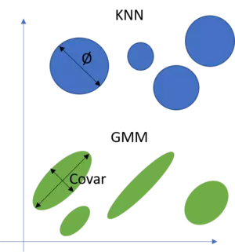
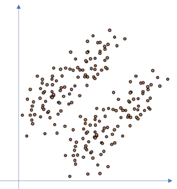
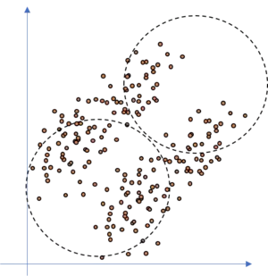
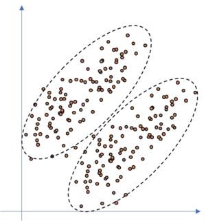

# Gaussian Mixture Models

## First -- What is a Gaussian?

## A Distribution is a listing of outcomes of an experiment and the probability associated with each outcome

## What is a Gaussian Mixture Model?

It's a probability distribution that consists of multiple probability distributions.

Hard vs Soft Assignment. Hard might lead to mis grouping.

Guassian Mixture:

Instead of Hard assgning data points to a cluster, if we are uncertain about the data points where they belong or to which group, we use this method. It uses probability of a sample to determine the feasibility of it belonging to a cluster.

## How is it Optimized?

The Expecation Maximization Algorithm!

#### Comparing to Gradient Descent 
You can obtain maximum likelihood estimates using different methods and using an optimization algorithm is one of them. On another hand, gradient descent can be also used to maximize functions other than likelihood function.

## When Should I Use it?

Anytime you have unlabeled data and want to classify it. If data is normally distributed. 

Predicting Customer Churn
Anomaly Detection
Object Tracking

    

      
    

    

      
    

    

      
    

  

