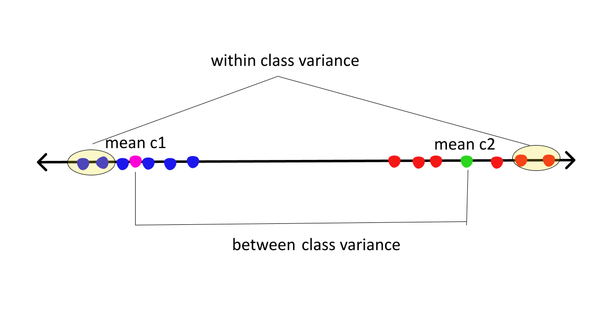
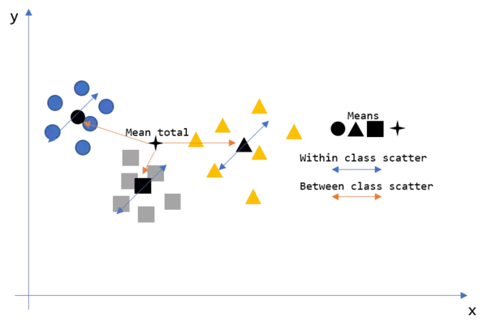

<h1>LDA:</h1>

Linear Discriminant Analysis as its name suggests is a linear model for classification and dimensionality reduction.

 LDA projects data from a D dimensional feature space down to a D’ (D>D’) dimensional space in a way to :
 <b>maximize the variability between the classes</b> and
  <b>reducing the variability within the classes</b>.

  

  <h2>Why LDA?:</h2>

 

Logistic Regression is one of the most popular linear classification models that perform well for binary classification but
    falls short in the case of multiple classification problems with well-separated classes. While LDA handles these quite efficiently.

LDA can also be used in data preprocessing to reduce the number of features just as PCA which reduces the computing cost significantly.

LDA is also used in face detection algorithms. In Fisherfaces LDA is used to extract useful data from different faces.
     Coupled with eigenfaces it produces effective results.

<h2>Shortcomings :</h2>

Linear decision boundaries may not effectively separate non-linearly separable classes. More flexible boundaries are desired.

    In cases where the number of observations exceeds the number of features,
     LDA might not perform as desired. This is called Small Sample Size (SSS) problem. Regularization is required.

