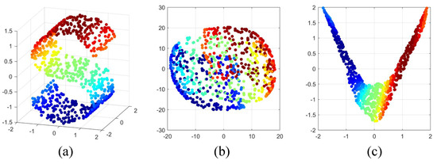

# Kernel Pca

PRINCIPAL COMPONENT ANALYSIS: is a tool which is used to reduce the dimension of the data. It allows us to reduce the dimension of the data without much loss of information. PCA reduces the dimension by finding a few orthogonal linear combinations (principal components) of the original variables with the largest variance.
The first principal component captures most of the variance in the data. The second principal component is orthogonal to the first principal component and captures the remaining variance, which is left of first principal component and so on. There are as many principal components as the number of original variables.
These principal components are uncorrelated and are ordered in such a way that the first several principal components explain most of the variance of the original data. To learn more about PCA you can read the article Principal Component Analysis

KERNEL PCA:

PCA is a linear method. That is it can only be applied to datasets which are linearly separable. It does an excellent job for datasets, which are linearly separable. But, if we use it to non-linear datasets, we might get a result which may not be the optimal dimensionality reduction. Kernel PCA uses a kernel function to project dataset into a higher dimensional feature space, where it is linearly separable. It is similar to the idea of Support Vector Machines.

There are various kernel methods like linear, polynomial, and gaussian.

 
<h2>Comparison of KPCA to standard PCA :</h2>

    The standard PCA
    always finds linear principal components. It serves to represent a given large data
    set into a suitable choice of principal components for lower dimension. But PCA
    will fail to find good representative directions when applied to most non-linear
    data of interest.

For non-linear and more tricky data sets, one turns instead to
    Kernel PCA (KPCA). It has the following advantages and features (not a com-
    plete list):

<b>(i) KPCA will perform PCA but in a new space.</b>

<b>(ii) It uses diverse
    kernel tricks in order to still find principal components, but they will be in a different space 
    (typically in a higher dimensional space.)</b>

