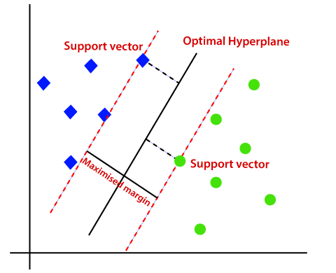

<h1>Support Vector Machine(SVM):</h1>

    SVM is a powerful supervised algorithm that works best on smaller datasets but on complex ones.
     Support Vector Machine, abbreviated as SVM can be used for both regression and classification tasks, 
     but generally, they work best in classification problems.

<h2>What is a Support Vector Machine?</h2>

    It is a supervised machine learning problem where we try to find a hyperplane that best separates the two classes.
    Both SVM and logistic regression try to find the best hyperplane,
    but the main difference is logistic regression is a probabilistic approach whereas support vector machine is based on statistical approaches.

    Now the question is which hyperplane does it select?
    There can be an infinite number of hyperplanes passing through a point and classifying the two classes perfectly.
    So, which one is the best?

    Well, SVM does this by finding the <b>maximum margin between the hyperplanes</b> that means maximum distances between the two classes.

<h2>Types of Support Vector Machine</h2>

<h3>Linear SVM</h3>

    When the data is perfectly linearly separable only then we can use Linear SVM.
 Perfectly linearly separable means that the data points can be classified into 2 classes by using a single straight line(if 2D).

<h3>Non-Linear SVM</h3>

    When the data is not linearly separable then we can use Non-Linear SVM,
which means when the data points cannot be separated into 2 classes by using a straight line (if 2D)
then we use some advanced techniques like kernel tricks to classify them.
In most real-world applications we do not find linearly separable datapoints hence we use kernel trick to solve them.

<h2>Two main terms which will be repeated again and again in SVM definition:</h2>

<h3>Support Vectors:</h3>

    These are the points that are closest to the hyperplane.
    A separating line will be defined with the help of these data points.   

 <h3>Margin: </h3>

    it is the distance between the hyperplane and the observations closest to the hyperplane (support vectors).
    In SVM large margin is considered a good margin.
    There are two types of margins <b>hard margin</b> and <b>soft margin</b>.

 
 

 <h2>How does Support Vector Machine work?</h2>
 

    SVM is defined such that it is defined in terms of the <b>support vectors only</b>,
    we don’t have to worry about other observations since the margin is made using the points which are closest to the hyperplane (support vectors).   
 

<h3>Suppose we have a dataset that has two classes (green and blue).
     We want to classify that the new data point as either blue or green :</h3>

<table>
    <tr>
        <td></td>
        <td></td>
        <td></td>
    </tr>
</table>

    To classify these points, we can have many decision boundaries,
    but the question is which is the best and how do we find it?

    The best hyperplane is that plane that has the maximum distance from both the classes,
    and this is the main aim of SVM.
    This is done by finding different hyperplanes which classify the labels in the best way
    then it will choose the one which is farthest from the data points or the one which has a maximum margin.

<h2>Soft Margin SVM</h2>

 
In real-life applications we don’t find any dataset which is linearly separable,
what we’ll find is either an almost linearly separable dataset or a non-linearly separable dataset.

To tackle this problem what we do is modify to such a way that it <b>allows few misclassifications</b> that means it <b>allows few points to be wrongly classified</b>.

<h2>Kernels in Support Vector Machine</h2>

Interesting feature of SVM is that it can even work with a non-linear dataset and for this,
we use “Kernel Trick” which makes it easier to classifies the points. 

Suppose we have a dataset that we cannot draw a single line or say hyperplane which can classify the points correctly.
So what we do is try <b>converting this lower dimension space to a higher dimension</b> space using some quadratic functions which will allow us to find a decision boundary that clearly divides the data points.
These functions which help us do this are called <b>Kernels</b> and which kernel to use is purely determined by hyperparameter tuning.

<table>
    <tr>
        <td></td>
        <td></td>
    </tr>
</table>

