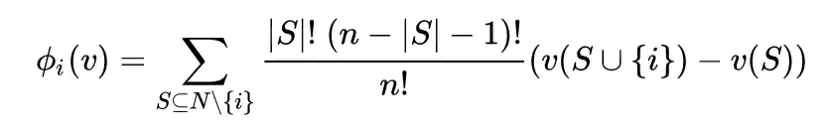

<h1>Shapley Value</h1>

<h2>Explain your model predictions with Shapley Values</h2>

<h3>Shapley Value used to explain your model predictions and get insights into the model development process.</h3>

    Machine learning has great potential for improving products, 
    processes and services. A dataset is supplied as input and algorithms produce the desired output. 
    But, algorithms do not explain their predictions. 
    It acts as a barrier to the adoption of machine learning. 
    In this case, <b>interpretable machine learning models</b> come to the rescue.

<b>
    In the context of machine learning, 
    interpretability helps us to understand how a model has made a particular decision.
</b>

    In terms of Interpretable Machine Learning - Shapley Values, Shapley Values can be defined as-
    A prediction can be explained by assuming that each feature value of the instance is a “player”
    in a game where the prediction is the payout. 
    Shapley values – a method from coalitional game theory – tells us how to fairly distribute the “payout”
    among the features.

    Before we start, I would like to introduce serval key concepts we will use in the later calculation. 
    Notice that I define characteristic function simply as the sum of conversions that the coalition generated.

<ul>
    <li>N = Channels{House ads, Facebook, Email, Google, etc.} It is a set of players</li>
    <li>N = Channels{House ads, Facebook, Email, Google, etc.} It is a set of players</li>
    <li>|𝑆| is the cardinality of coalition 𝑆 and the sum extends over all subsets 𝑆 of n not containing channel i.</li>
    <li>n = Number of N</li>
    <li>
        v(S) = A real-valued function v, called the characteristic function.
         The contribution of S which denotes a coalition of N (channels). 
         It is the weight of each channel after calculation.
    </li>
    <li>Weight = |S|!(n-|S|-1)!/n!</li>
    <li>Marginal contribution = v(S U {i})-v(S) Incremental weighted sum minus the coalition without v(S)</li>
</ul>

