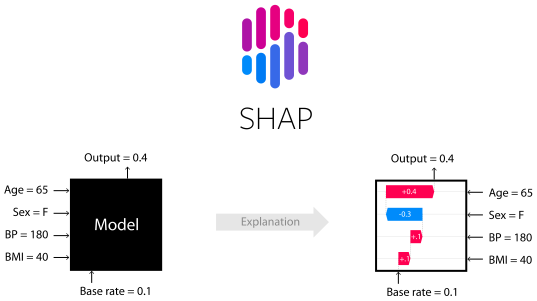

<h1>Shapley Value</h1>

<h2>Explain your model predictions with Shapley Values</h2>

<h3>Shapley Value used to explain your model predictions and get insights into the model development process.</h3>

    Machine learning has great potential for improving products, 
    processes and services. A dataset is supplied as input and algorithms produce the desired output. 
    But, algorithms do not explain their predictions. 
    It acts as a barrier to the adoption of machine learning. 
    In this case, <b>interpretable machine learning models</b> come to the rescue.

<b>
    In the context of machine learning, 
    interpretability helps us to understand how a model has made a particular decision.
</b>

    In terms of Interpretable Machine Learning - Shapley Values, Shapley Values can be defined as-
    A prediction can be explained by assuming that each feature value of the instance is a “player” 
    in a game where the prediction is the payout. 
    Shapley values – a method from coalitional game theory – tells us how to fairly distribute the “payout” 
    among the features.

### Read more :
https://christophm.github.io/interpretable-ml-book/shapley.html
